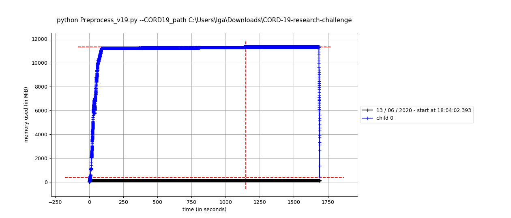

# Preprocessing CORD19 v19

To facilitate the annotation process for the 
CORD19 collection of scientific papers we are building a pipeline consisting of:

* [Spacy](https://spacy.io/) library
* [SciSpacy](https://allenai.github.io/scispacy/) library and models:
  * en\_core\_sci\_lg
  * en\_ner\_craft\_md
  * en\_ner\_jnlpba\_md
  * en\_ner\_bc5cdr\_md
  * en\_ner\_bionlp13cg\_md
* [Pathos](https://pypi.org/project/pathos/) multiprocessing
* [Langdetect](https://github.com/Mimino666/langdetect) for language detection
* [Googletrans](https://github.com/ssut/py-googletrans) for translation of non-English publications
* [tqdm](https://github.com/tqdm/tqdm) library for progress bars
* [Memory Profiler](https://github.com/pythonprofilers/memory_profiler) for development purposes
* [Pandas](https://pandas.pydata.org/) for Cord19 metadata file processing
* cuasal Python3.7 built-in libraries (random, os, utils etc...)

SciSpacy may malfunction in one way or another because of dependency differences. 
Please, pay attention to requirements file.

## Usage

### With default settings

In your command line:

`python preprocess_v19.py --CORD19_path <cord19path> --delta <yourdeltajsonfile>`
 
Default preprocessing includes all SciSpacy models and takes all files from the data collection (no delta-based skipping). 
 
### RAM monitoring

If you want to monitor RAM usage with Memory Profiler:

`mprof run --multiprocess python preprocess_v19.py --CORD19_path <cord19path> --delta <yourdeltajsonfile>`

After the execution you can plot data from Memory Profiler by:
`mprof plot`

If you execute the CORD19 pipeline on a server, you can just download the log file of Memory Profiler and run it locally. More [here](https://pypi.org/project/memory-profiler/). 

### User-specific settings

In the command line we can specify a couple of settings, like:

* models for pipeline:
  * `--en_core_sci_lg True/False`
  * `--en_ner_craft_md True/False` 
  * `--en_ner_jnlpba_md True/False`
  * `--en_ner_bc5cdr_md True/False`
  * `--en_ner_bionlp13cg_md True/False`

* maximal number of files to process. Default `None` (all files read-in).
    
    `--max_n_files 10`
  
* Delta json file with SHAs of the files already annotated in another run.
It may be useful when want to just expand our database with a subset of CORD19 files. The layout of the [Delta file](#delta-file).

    `--delta <yourjsonfile.json>`

* Minimal amount of free RAM that each worker should have access to. Default 12 GiB (recommended amount if all models used).

    `--RAM_per_worker 12`

* Path to CORD19 dataset (The only obligatory variable to pass). The pipeline is constructed for version 19 of the dataset. 

   `--CORD19_path <yourpath>`

### Delta file

If we want to process just a part of our dataset based on a so-called Delta file. In our case it will be a json file with two entries: 
a self- `description` and a `delta list` of SHA ID's of files that we want to exclude from the process.

    {"description":"Delta file with SHA ID's that are supposed to be ignored in the CoronaWhy annotation pipeline", 
    "delta list": ["003d2e515e1aaf06f0052769953e861ed8e56608", "00a407540a8bdd6d7425bd8a561eb21d69682511", "00c386ee8b9fac7eeb2291a72d52966d83eec814","024b30561568979f525d8b2580f85122c02008a0"]}

### Structure of output files

The output files are in JSON format. Each paper's sentence and section receives its own id, by which can be directly browsed. The papers in languages other than English are automatically translated. Each output file should consist of the following entries:
    	
* `paper_id`: ID from CORD19, like `"000eec3f1e93c3792454ac59415c928ce3a6b4ad"`
    
* `abstract`: list of abstract text ID's if available, like:

    `["d04b9df0-ad8e-11ea-9703-98fa9b740088", "d0511bee-ad8e-11ea-9180-98fa9b740088","d06e40d4-ad8e-11ea-ba29-98fa9b740088"]`
	
* `text_body`: a list of paper sections' dictionaries, by which we can browse the whole document. Each mini-dictionary has two keys: `section_id` and `section_name`:

	`{"section_id":"d08fd14a-ad8e-11ea-9a80-98fa9b740088", "section_name":"introduction"}`
          
* `language`: self-evident, in the case of non-English papers ( `fr`, `it`, `jp`) it should be accompanied by `original text` entry.     
   `{"language":"fr"}`
* `original_text`: the original source text subsequently translated and annotated by English language models.

    `"original_text":"Abstract\nReçu et accept…arge de ces infections."`

* `tables`: tables extracted from the source text

* ID's of sections and sentences.

To learn more on CoronaWhy annotation style, please look up this [notebook]().
